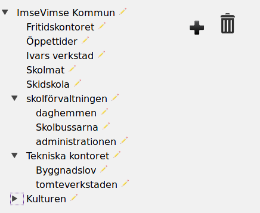

# leamas's react-dnd-tree README

## General

This page is best viewed at [github](http://github.com/leamas/react-dnd-tree).

react-dnd-tree is a drag-and-drop and react-based treeview. It focuses on
the generic tree operations: move, rename, add and delete.

Main characteristics:

  - Based on react's drag and drop library.
  - Stateless.
  - Server can be updated using a single onChange callback or using
    callback properties fired at specific events.
  - Optimistic update strategy, data is updated without waiting for server.
  - Several components available to use the thing in different ways
  - GPL 2.0+ licensed.

## Installation

    npm install @leamas/react-dnd-tree

## Usage

The tree can be used in different ways. One way is using the UIBasicTree
interface. This is a plain tree allowing user to move and rename nodes.
Example code in [src/demo1.js](src/demo1.js)

Another option is using the default TreeView interface. This adds functionality
and UI where user can add and delete tree nodes. Example code in
[src/demo2.js](src/demo2.js), screenshot above and a live demo at
http://mumin.crabdance.com.

demo1 and demo2 assumes that the server supports the onChange semantics. Some
servers does not and requires the client to use separate functions such as
onMoveNode or onEdit. Example code in [src/demo4.js](src/demo4.js).

Here is also hooks for users who wants to add more properties than just a name
to each node. Using these hooks a user can redefine the form used to edit a
node's properties. Example code in [demo3.js](src/demo3.js).

Here is also code to customize the way a regular node is rendered e. g., by
adding a callback invoked when user clicks on a node. Example code in
[demo5.js](src/demo5.js).

In general, you should be able to pick one of the demos and adapt it by
implementing the stub routines. It is also possible to combine the basic
components like BasicTree, AddTool and Trashcan into new layouts and
functionalities.

## Properties

### BasicTree

Unless stated, all properties are optional. See the demo files for more info on
methods.

| Prop        | What                                                           |
|-------------|----------------------------------------------------------------|
| contents    | The actual data, see Data Model below. Mandatory.              |
| onChange    | function onChange(contents) - called when contents was changed.|
| onEdit      | function onEdit(node) - called when user edited a node.        |
| onMoveNode  | function(newParent, oldparent) - called when user moved a node.|
| options     | General options, see below.                                    |

## TreeView

TreeView adds more props to add/delete items:

| Prop            | What                                                     |
|-----------------|----------------------------------------------------------|
| onDeleteNode    | function onDelete(id) - called when user deletes a node. |
| onAddNode       | function onAddNode(nodes, text, id) - user adds a node.  |

## Data Model

The tree is actually not really a tree but a forest - the root element is a
list of nodes. Each node is an object with some known properties:

 - id: int - must be unique and > 0.
 - name: string - the user visible label.
 - children: list [node] -  child list, possibly [].
 - collapsed: boolean - if child list is displayed or not.
 - editing: boolean - if node is currently being edited.

The tree operations does not interfere with whatever other node
properties defined. However, the *icon* property is reserved for future use.

## Options

Some components shares a common *options* property, an object  defining
various application configuration:

 - enableEdit: boolean - flag to enable/disable user edit of node names.
 - formEdit: function(node, onEdit) - returns a form for editing a node,
   presumable with other properties than just the default name. See
   [src/demo3.js](src/demo3.js).
 - customBody: function(node, props) - returns a body for the rendered node,
   replacing the default plain node name. See [src/demo5.js](src/demo5.js).

## Component structure and classname.

Many components refers to a *className* intended for styling. None of these
are used internally.

     TreeView   [rdt_view]
     |
     +--> Trashcan  [rdt_trashcan]
     |
     +--- AddTool   [rdt_add]
     |
     +--> BasicTree [rdt_tree]
           |
           +---> Node      [rdt_node]
           |
           ----> Sink      [rdt_sink]

     ErrorMessage  (no class)

## Server interaction

All operations are done locally without waiting for server response. If the server
update fails, there is an ErrorMessage component which can be used. By default,
it displays a red box in the bottom-right display corner.

All changes of data triggers a call to the onChange function property. The
other function properties are also called as appropriate. User could use any
way to keep server updated.

## Caveats

react-dnd-tree uses css modules. config/webpack\*.conf has been updated to
support this, and it shouldn't be a concern unless cloning the code.

The dnd capabilities depends on a single, global DragDropContext. The
Treeview and the UIBasicTree components defines such a context, and using
any of these makes it impossible to use dnd in other parts of the
application. You might want to use BasicTree, AddTool and Trashcan and
declare the DragDropContext in the main app should this became a problem.

## License

This work is copyright(c) Alec Leamas 2016. It can be used according to the
GPL 2.0 license as described in LICENSE.html or any later version of the GPL
license.
